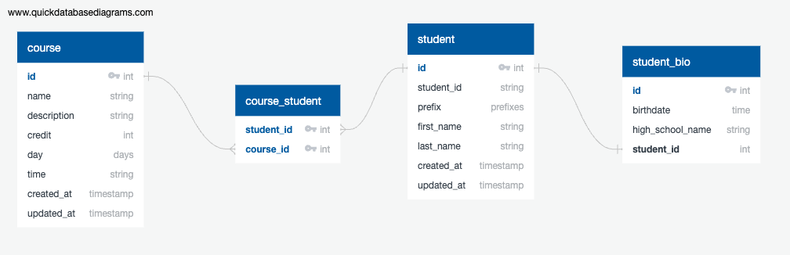

# Database Workshop 2022

### Stacks
- [Typescript](https://www.youtube.com/playlist?list=PLDE8jVJ4bnxwUu6agtUGu354udaxtVnUN)
- [Express.js](https://youtu.be/BJJWuR-pfKs)
- [Database Relatoin](https://youtu.be/-hVeaDVl-6E)
- [PostgreSQL](https://www.postgresql.org/)
- [Prisma](https://www.prisma.io/)
- [MVC architecture](https://youtu.be/yWC0_9q1jck)
- [pnpm](https://pnpm.io/)

## Get start !

clone project template in to your workspace
```bash
git clone https://github.com/thinc-org/database-workshop-2022.git
```

if you haven't installed `pnpm` yet.
```bash
npm install -g pnpm
```

then run
```bash
cd database-workshop-2022

pnpm install
```

## Requirments

- Design schemas following database diagram below.

- Fill code into controllers following `DTO` in `src/dto` folder

